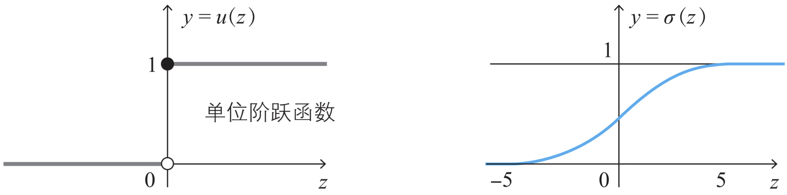

# N1: Idea of Neural Networks

12/02/2021 [KevinZonda](https://github.com/KevinZonda)

## Regularise the Neuron

### Input

The input of neuron is a $N$ dimension vector (or $N$-size array), we call it $x_1, x_2, x_3, \cdots, x_N$.

Then every dimension of input has a weight $w_i$.

So usually, weighted input could be represented as:

$$
\text{INPUT}=w_1x_1 + w_2x_2 + w_3x_3 + \cdots + w_Nx_N
$$

### Bias

The neuron has a bias $\theta$. If the weighted input is greater than or equals $b$, the neuron will output 1, otherwise 0.

We use a *heaviside step function (单位阶跃函数)* to help represent the bias:

$$
u(z)=\begin{cases}
0 & \text{if } z<0 \\
1 & \text{if } z\geq 0
\end{cases}
$$

Usually, in the $z$ of above equation, the $z$ is the weighted input minus bias. I.e.:

$$
z=w_1x_1 + w_2x_2 + w_3x_3 + \cdots + w_Nx_N-\theta\\
y=u(z)
$$

### Normalise to Activation Function

To normalise the input, we can define the *activation function* $a$:

$$
y=a(w_1x_1 + w_2x_2 + w_3x_3 + \cdots + w_Nx_N-\theta)
$$

### Sigmoid Function

However, the activation function $a$ could be $u(z)$ but also could not be.

In most times, we use Sigmoid function $\sigma(z)$:

$$
\sigma(z)=\frac{1}{1+e^{-z}}
$$

The output of sigmoid function, if is closer to 0, it represents low excitability of the neuron, and if is closer to 1, it represents high excitability of the neuron.