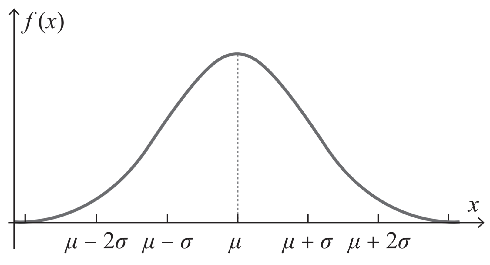
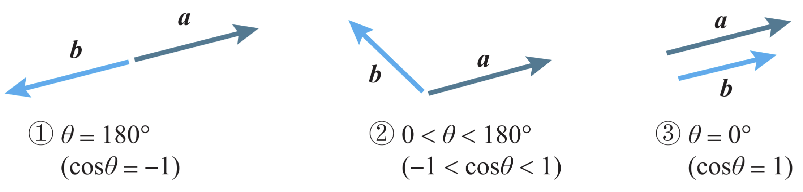
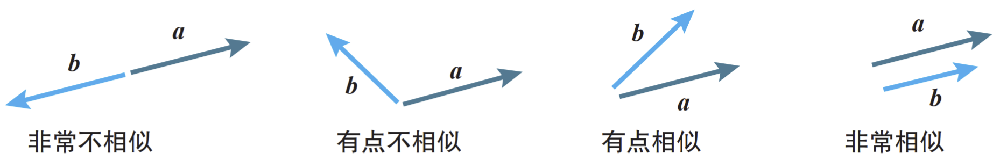

# N2: Mathematical Foundations of Neural Networks

## Linear Function/一次函数

$$
y=kx+b (k, b \text{ are constants}, k\neq 0)
$$

$k$: slope (斜率) of the line.  
$b$: intercept (截距) of the line.

## Quadratic Function/二次函数

$$
y=kx^2+bx+c (k, b, c \text{ are constants}, k\neq 0)
$$

## Heaviside Step Function/单位阶跃函数

$$
u(x)=\begin{cases}
0 & \text{if } x<0 \\
1 & \text{if } x\geq 0
\end{cases}
$$

## Sigmoid Function/Sigmoid 函数

$$
\sigma(x)=\frac{1}{1+e^{-x}}
$$

## Probability Density Function for Normal Distribution/正态分布的概率密度函数

$$
f(x)=\cfrac{1}{\sqrt{2\pi}}e^{-\frac{(x-\mu)^2}{2\sigma^2}}
$$

$\mu$: mean/expected value/期待值/平均值  
$\sigma$: standard deviation/标准差

## Sigma Function/Sigma 函数

$$
\sum^n_{k=1}(a_k+b_k)=\sum^n_{k=1}a_k+\sum^n_{k=1}b_k\\
\sum^n_{k=1}ca_k=c\sum^n_{k=1}a_k (c \text{ is a constant})
$$

## Vector

### Length

$$
\text{len}(\vec{v})=\sqrt{\sum^n_{k=1}v_k^2}
$$

### Inner Product

$$
\vec{a}\cdot \vec{b}=|\vec{a}||\vec{b}|\cos\theta
$$

Or

$$
\vec{a}\cdot \vec{b}=a_1b_1+a_2b_2+a_3b_3+\cdots+a_Nb_N
$$

### Cauchy–Schwarz Inequality

$$
-|\vec{a}||\vec{b}|
\leq
\vec{a}\cdot\vec{b}
\leq
|\vec{a}||\vec{b}|
$$

$$
-|\vec{a}||\vec{b}|
\leq
|\vec{a}||\vec{b}|\cos\theta
\leq
|\vec{a}||\vec{b}|
$$

| When 2 Vectors      | Inner Product |
| :------------------ | :------------ |
| Opposite Directions | Minimum       |
| Not Parallel        | Middle        |
| Same Direction      | Maximum       |

## Matrix

// TO BE CONTINUED: pp. 61, section 2-5